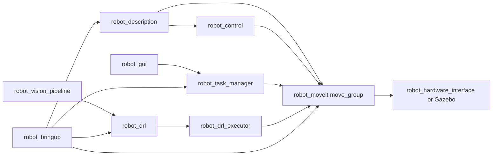

# ROS2 Robot Workspace Documentation

## 1. Tổng quan
Workspace `~/ros2_dev/src` gồm 13 package ROS2 cho mô tả robot, ros2_control, MoveIt, task action/service, DRL planner, GUI, hardware interface và vision pipeline. Source of truth là source code hiện tại trong từng package.

## 2. Danh sách package
| Package | Vai trò |
|---|---|
| robot_description | URDF/Xacro, mesh, Gazebo world/object spawn |
| robot_control | ros2_control controllers và launch controller manager |
| robot_moveit | MoveIt config, move_group launch, RViz/GUI launch |
| robot_hardware_interface | TCP/RS485 hardware node, ros2_control plugin, service/msg hardware |
| robot_task_manager | Action servers MoveIt/gripper/pick-place/DRL/repeatability |
| robot_task_executor | Service-based MoveIt executor legacy |
| robot_task_executor_msgs | Service contracts cho executor |
| robot_drl | DRL planner, mock environment, obstacle tests |
| robot_drl_executor | Cartesian pose sequence MoveIt service cho DRL |
| robot_gui | Qt GUI, hardware controls, action clients, RViz embed |
| robot_vision_pipeline | YOLO/ArUco/depth/object pose pipeline |
| robot_vision_pipeline_msgs | Message contracts cho object detections |
| robot_bringup | Launch tổng hợp sim/real/demo |

## 3. Luồng hoạt động chính


## 4. Build nhanh
```bash
cd ~/ros2_dev
colcon build
source install/setup.bash
```

## 5. Chạy nhanh
- Simulation tổng hợp: `ros2 launch robot_bringup sim.launch.py`
- Real/GUI: `ros2 launch robot_bringup real.launch.py`
- MoveIt mock: `ros2 launch robot_moveit moveit_mock.launch.py`
- GUI riêng: `ros2 launch robot_gui robot_gui.launch.py`
- Vision full pipeline: `ros2 launch robot_vision_pipeline vision_full_pipeline.launch.py`

## 6. Tài liệu chi tiết
Mỗi package có `README.md`, `DATA_FLOW.md`, `PARAMETERS.md`, `LAUNCH.md`; package liên quan MoveIt/action/service có thêm `MOVEIT_ACTION_FLOW.md`.
