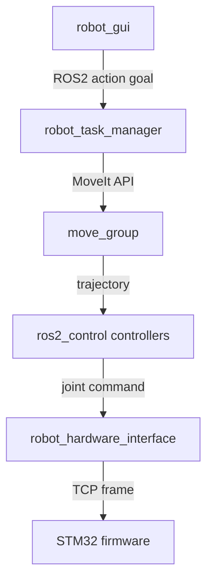
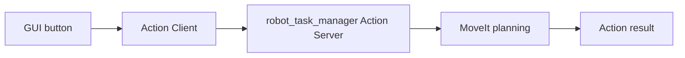

Yêu cầu Codex rà soát và cập nhật toàn bộ tài liệu README cho tất cả package trong thư mục `src` của workspace ROS2.

## 1. Mục tiêu tổng quát

Trong workspace:

```bash
~/ros2_dev/src
```

cần cập nhật tài liệu chuyên nghiệp, chi tiết, có cấu trúc rõ ràng cho:

1. Toàn bộ workspace `src`.
2. Từng package ROS2 bên trong `src`.
3. Từng package phải có tài liệu:

   * README tổng thể package.
   * Luồng dữ liệu.
   * Cấu hình/tham số mặc định.
   * Launch file và điều kiện thực thi.
   * Nếu package có action/service liên quan MoveIt thì phải có thêm tài liệu chi tiết luồng thực thi action/service.

Yêu cầu tài liệu phải dựa trên source code thực tế, không viết đoán.

---

## 2. Quy tắc bắt buộc

### Không được làm

* Không sửa logic code.
* Không sửa `.cpp`, `.hpp`, `.py`, `.launch.py`, `.yaml`, `.ui` nếu không cần cho tài liệu.
* Không đổi tên package.
* Không đổi launch.
* Không đổi action/service.
* Không tự bịa chức năng không có trong code.
* Không viết README kiểu chung chung.
* Không ghi “TODO” thay cho nội dung đã có thể xác định từ source.

### Phải làm

* Đọc từng `package.xml`.
* Đọc `CMakeLists.txt` hoặc `setup.py/setup.cfg`.
* Đọc thư mục:

  * `src/`
  * `include/`
  * `launch/`
  * `config/`
  * `action/`
  * `srv/`
  * `msg/`
  * `scripts/`
  * `urdf/`
  * `xacro/`
  * `worlds/`
  * `gazebo/`
  * `ui/`
* Liệt kê node, executable, launch, topic, service, action, parameter dựa trên code.
* Nếu không chắc phần nào, ghi rõ “Chưa xác định từ source hiện tại”, không suy đoán.

---

## 3. Tài liệu bắt buộc ở cấp workspace `src`

Tạo hoặc cập nhật file:

```text
src/README.md
```

Nội dung bắt buộc:

### 3.1 Tổng quan workspace

Mô tả workspace đang gồm những nhóm chính:

```text
- robot_bringup
- robot_description
- robot_hardware_interface
- robot_gui
- robot_task_manager
- robot_drl
- robot_vision_pipeline
- các package khác nếu có
```

Không cố định danh sách trên nếu source thực tế khác. Phải scan toàn bộ package có `package.xml`.

### 3.2 Bảng package

Tạo bảng:

```markdown
| Package | Vai trò | Node chính | Launch chính | Phụ thuộc chính |
|---|---|---|---|---|
```

### 3.3 Kiến trúc tổng thể

Viết mô tả kiến trúc cấp hệ thống:

```text
GUI / User command
    ↓
robot_gui
    ↓ action/service/topic
robot_task_manager
    ↓ MoveIt / ros2_control / DRL / Vision
robot_hardware_interface
    ↓ TCP/Ethernet hoặc mock hardware
STM32 / robot hardware
```

Điều chỉnh đúng theo source thực tế.

### 3.4 Luồng hoạt động tổng thể

Tạo file:

```text
src/DATA_FLOW.md
```

Nội dung gồm:

* Luồng bringup robot thật.
* Luồng mock hardware.
* Luồng Gazebo simulation nếu có.
* Luồng GUI gọi action.
* Luồng MoveIt planning/execution.
* Luồng DRL nếu có.
* Luồng vision nếu có.
* Luồng hardware TCP nếu có.

Dùng sơ đồ Mermaid hoặc ASCII.

Ví dụ Mermaid:



### 3.5 Cách build và source workspace

Trong `src/README.md`, thêm:

```bash
cd ~/ros2_dev
colcon build --symlink-install
source install/setup.bash
```

Nếu có package cần build riêng, ghi rõ.

### 3.6 Launch theo chế độ

Tạo bảng:

```markdown
| Chế độ | Lệnh launch | Điều kiện cần | Ghi chú |
|---|---|---|---|
| Mock hardware | ... | ... | ... |
| Real hardware | ... | ... | ... |
| Gazebo | ... | ... | ... |
| GUI | ... | ... | ... |
| Task servers | ... | ... | ... |
```

---

## 4. Tài liệu bắt buộc trong từng package

Với mỗi package trong `src/<package_name>`, tạo/cập nhật tối thiểu các file sau:

```text
src/<package_name>/README.md
src/<package_name>/DATA_FLOW.md
src/<package_name>/PARAMETERS.md
src/<package_name>/LAUNCH.md
```

Nếu package có action/service liên quan MoveIt, tạo thêm:

```text
src/<package_name>/MOVEIT_ACTION_FLOW.md
```

Nếu package không có launch file, vẫn tạo `LAUNCH.md` và ghi rõ:

```text
Package này hiện không có launch file riêng.
```

Nếu package không có parameter, vẫn tạo `PARAMETERS.md` và ghi rõ:

```text
Chưa phát hiện parameter runtime trong source hiện tại.
```

---

## 5. Nội dung `README.md` cho từng package

Mỗi package README phải có cấu trúc:

```markdown
# <package_name>

## 1. Vai trò package

## 2. Vị trí trong hệ thống

## 3. Thành phần chính

## 4. Node / executable

## 5. Topic / Service / Action

## 6. File launch liên quan

## 7. File cấu hình liên quan

## 8. Cách build riêng package

## 9. Cách chạy nhanh

## 10. Ghi chú kỹ thuật / giới hạn hiện tại
```

### Bảng node/executable

```markdown
| Executable | Node name | File source | Vai trò |
|---|---|---|---|
```

### Bảng topic/service/action

```markdown
| Interface | Type | Direction | Vai trò |
|---|---|---|---|
| /joint_states | sensor_msgs/msg/JointState | subscribe/publish | ... |
```

Direction phải ghi rõ:

```text
publish
subscribe
client
server
action client
action server
service client
service server
```

---

## 6. Nội dung `DATA_FLOW.md` cho từng package

Mỗi package phải có tài liệu luồng dữ liệu riêng.

Cấu trúc:

```markdown
# <package_name> - Data Flow

## 1. Mục tiêu luồng dữ liệu

## 2. Input

## 3. Output

## 4. Internal processing

## 5. Sơ đồ luồng dữ liệu

## 6. Liên kết với package khác

## 7. Các điểm cần chú ý
```

### Phải mô tả rõ

* Package nhận dữ liệu từ đâu.
* Dữ liệu đi qua node/class/function nào.
* Dữ liệu được biến đổi như thế nào.
* Dữ liệu xuất ra đâu.
* Topic/service/action nào được dùng.
* Frame nào được dùng nếu liên quan TF/MoveIt.
* Unit nào được dùng nếu liên quan pose/joint/gripper.

### Bắt buộc có sơ đồ

Dùng Mermaid hoặc ASCII.

Ví dụ:



---

## 7. Nội dung `PARAMETERS.md`

Mỗi package phải có file:

```text
PARAMETERS.md
```

Cấu trúc:

```markdown
# <package_name> - Parameters

## 1. Tổng quan

## 2. Bảng parameter

| Parameter | Default | Type | Nơi khai báo | Nơi sử dụng | Ý nghĩa |
|---|---:|---|---|---|---|

## 3. Parameter theo launch file

## 4. Parameter theo YAML config

## 5. Giá trị mặc định quan trọng

## 6. Ghi chú thay đổi / rủi ro cấu hình
```

### Yêu cầu

Phải scan:

```text
declare_parameter
get_parameter
LaunchConfiguration
DeclareLaunchArgument
parameters=[...]
config/*.yaml
```

Nếu có parameter trong YAML nhưng không thấy code dùng, ghi rõ.

Nếu có code dùng parameter nhưng không thấy khai báo launch/YAML, ghi rõ.

---

## 8. Nội dung `LAUNCH.md`

Mỗi package phải có file:

```text
LAUNCH.md
```

Cấu trúc:

```markdown
# <package_name> - Launch Guide

## 1. Danh sách launch file

| Launch file | Mục đích | Node được chạy | Điều kiện cần |
|---|---|---|---|

## 2. Chi tiết từng launch file

### <file>.launch.py

#### Chức năng

#### Node được khởi tạo

#### Argument

| Argument | Default | Ý nghĩa |
|---|---:|---|

#### Parameter truyền vào node

#### Package phụ thuộc

#### Điều kiện thực thi

#### Lệnh chạy

#### Lỗi thường gặp
```

### Phải ghi rõ launch phụ thuộc

Ví dụ:

```text
Launch A phụ thuộc:
- robot_description
- robot_state_publisher
- controller_manager
- move_group
- task_servers
- Gazebo
```

Nếu launch include launch khác, phải ghi rõ:

```text
IncludeLaunchDescription(...)
```

và file được include.

### Phải ghi rõ điều kiện thực thi

Ví dụ:

```text
- Cần source install/setup.bash
- Cần move_group đang chạy
- Cần controller active
- Cần action server /move_to_pose available
- Cần Gazebo nếu use_gazebo=true
- Cần hardware thật nếu real.launch.py
```

---

## 9. File `MOVEIT_ACTION_FLOW.md`

Với các package có action/service liên quan MoveIt, đặc biệt như:

```text
robot_task_manager
robot_gui nếu có action client gọi task_manager
robot_bringup nếu launch MoveIt
```

phải tạo/cập nhật:

```text
MOVEIT_ACTION_FLOW.md
```

Nội dung bắt buộc:

```markdown
# <package_name> - MoveIt / Action Execution Flow

## 1. Tổng quan

## 2. Danh sách action/service liên quan MoveIt

| Action/Service | Type | Server/Client | File source | Vai trò |
|---|---|---|---|---|

## 3. Luồng execute chung

## 4. Luồng plan-only

## 5. Chi tiết từng action/service

## 6. Feedback/result

## 7. Điều kiện thành công/thất bại

## 8. Phụ thuộc runtime

## 9. Sơ đồ sequence
```

### Với từng action phải ghi rõ

Nếu có các action sau thì phải mô tả chi tiết:

```text
/gohome
/move_to_pose
/move_to_pose_cartesian
/move_checker_board
/move_gripper
/pickplace
/drl_pickplace
/repeatability_test
```

Không bịa nếu source không có action nào.

Mỗi action phải có:

```markdown
### /move_to_pose

- Type:
- Server executable:
- Goal:
- Result:
- Feedback:
- Parameter liên quan:
- Sequence xử lý:
- Điều kiện reject:
- Điều kiện success:
- Điều kiện fail:
- execute=true:
- execute=false:
```

### Luồng thực thi phải chi tiết

Ví dụ:

```text
GUI Start button
    ↓
Action client tạo goal execute=true
    ↓
/move_to_pose action server
    ↓
Validate pose + velocity
    ↓
MoveIt set target pose
    ↓
Plan trajectory
    ↓
Nếu execute=true: execute trajectory
Nếu execute=false: skip execution
    ↓
Return result
```

### Với PickPlace phải mô tả composite flow

Ví dụ:

```text
Open gripper
→ Move to pre-pick
→ Cartesian down
→ Close gripper
→ Lift
→ Move to pre-place
→ Cartesian down
→ Open gripper
```

### Với Repeatability Test phải mô tả loop

```text
Move retract
→ Cartesian meas pose
→ wait settle
→ back retract
→ disturb 1
→ disturb 2
→ back retract
→ repeat N times
```

### Với DRL PickPlace phải mô tả phần phụ thuộc

```text
- DRL planner node
- /drl/plan
- /drl/execute_forward
- /drl/get_execution_status
- MoveIt Cartesian sub-action
- Gripper action
```

Nếu thiếu backend để test thì ghi rõ.

---

## 10. Tài liệu riêng theo nhóm package

### 10.1 `robot_gui`

Nếu có package `robot_gui`, README phải mô tả:

* GUI load file `.ui` nào.
* Các tab chính.
* `TaskControlPanel`.
* `cbModeControl`.
* `taskModeTabs`.
* Cách GUI gọi action.
* Cách GUI convert đơn vị:

  * GUI nhập mm.
  * ROS action nhận m.
  * `mm / 1000.0`.
* Default velocity scale trong GUI là `0.1`.
* Khu vực action log.
* Luồng button:

  * Plan → `execute=false`.
  * Start → `execute=true`.

Tạo thêm hoặc cập nhật:

```text
robot_gui/GUI_FLOW.md
```

nếu cần, nhưng vẫn phải có đủ `README.md`, `DATA_FLOW.md`, `PARAMETERS.md`, `LAUNCH.md`.

### 10.2 `robot_task_manager`

Nếu có package `robot_task_manager`, tài liệu phải rất chi tiết.

Bắt buộc có:

```text
robot_task_manager/MOVEIT_ACTION_FLOW.md
```

Phải mô tả tất cả action server, goal/result/feedback, sequence, dependency, timeout, default parameter.

Nếu đã có tài liệu action như `Call_action.md` hoặc file tương tự, phải đồng bộ nội dung và tham chiếu trong README.

### 10.3 `robot_hardware_interface`

Nếu có package này, phải mô tả:

* Mock hardware.
* Real hardware.
* TCP client nếu có.
* Interface với ros2_control.
* Joint state / command flow.
* Unit:

  * mdeg nếu dùng trong transport.
  * degree hoặc radian nếu dùng trong ROS.
* Service connect/disconnect nếu có.
* Hardware lifecycle nếu có.

### 10.4 `robot_description`

Phải mô tả:

* URDF/Xacro chính.
* Link/joint.
* ros2_control tag.
* MoveIt config nếu có.
* Gazebo model/world nếu có.
* Mesh/resource.
* Frame tree tổng quát.

### 10.5 `robot_bringup`

Phải mô tả:

* Launch tổng hợp.
* Real launch.
* Sim launch.
* Mock launch.
* Thứ tự bringup.
* Các package được include.
* Điều kiện chạy từng mode.

### 10.6 `robot_drl`

Phải mô tả:

* Node DRL.
* Planner/service/action nếu có.
* Model path.
* Observation.
* Action output.
* Reward nếu source có.
* Luồng DRL plan/execute.
* Phụ thuộc robot_task_manager/MoveIt/Gazebo nếu có.

### 10.7 `robot_vision_pipeline`

Nếu có, phải mô tả:

* Topic camera input.
* Topic detection output.
* YOLO/model path nếu có.
* Calibration/config.
* Output pose/object.
* Phụ thuộc RealSense/OpenCV/YOLO nếu có.

---

## 11. Chuẩn chất lượng tài liệu

Tài liệu phải:

* Viết bằng tiếng Việt kỹ thuật, rõ ràng, chuyên nghiệp.
* Có heading rõ ràng.
* Có bảng.
* Có sơ đồ luồng.
* Có lệnh chạy.
* Có điều kiện thực thi.
* Có lỗi thường gặp nếu xác định được.
* Có ghi chú “source of truth” là source code hiện tại.
* Không quá ngắn.
* Không viết mơ hồ kiểu “package này dùng để điều khiển robot” mà không nói điều khiển bằng gì, qua node nào, interface nào.

---

## 12. Script rà soát gợi ý

Trước khi viết tài liệu, chạy các lệnh rà soát:

```bash
cd ~/ros2_dev/src

find . -name package.xml
find . -name "*.launch.py"
find . -name "*.yaml" -o -name "*.yml"
find . -name "*.action"
find . -name "*.srv"
find . -name "*.msg"
find . -name "*.cpp" -o -name "*.hpp" -o -name "*.py"
```

Tìm node/executable:

```bash
grep -R "rclcpp::Node" -n .
grep -R "create_publisher" -n .
grep -R "create_subscription" -n .
grep -R "create_service" -n .
grep -R "create_client" -n .
grep -R "rclcpp_action" -n .
grep -R "create_server" -n .
grep -R "create_client" -n .
grep -R "DeclareLaunchArgument" -n .
grep -R "LaunchConfiguration" -n .
grep -R "declare_parameter" -n .
grep -R "get_parameter" -n .
```

Tìm MoveIt:

```bash
grep -R "MoveGroupInterface" -n .
grep -R "move_group" -n .
grep -R "computeCartesianPath" -n .
grep -R "plan(" -n .
grep -R "execute(" -n .
```

Tìm GUI/action:

```bash
grep -R "send_goal" -n .
grep -R "async_send_goal" -n .
grep -R "execute=false" -n .
grep -R "velocity_scale" -n .
```

---

## 13. Kiểm tra sau khi viết tài liệu

Sau khi cập nhật tài liệu, chạy:

```bash
cd ~/ros2_dev
find src -maxdepth 2 -name package.xml -print
```

Với mỗi package có `package.xml`, kiểm tra tồn tại:

```text
README.md
DATA_FLOW.md
PARAMETERS.md
LAUNCH.md
```

Nếu package có MoveIt/action/service liên quan thì kiểm tra thêm:

```text
MOVEIT_ACTION_FLOW.md
```

Có thể dùng script shell tạm:

```bash
cd ~/ros2_dev/src

for pkg in $(find . -mindepth 2 -maxdepth 2 -name package.xml -printf '%h\n'); do
  echo "Checking $pkg"
  test -f "$pkg/README.md" || echo "  MISSING README.md"
  test -f "$pkg/DATA_FLOW.md" || echo "  MISSING DATA_FLOW.md"
  test -f "$pkg/PARAMETERS.md" || echo "  MISSING PARAMETERS.md"
  test -f "$pkg/LAUNCH.md" || echo "  MISSING LAUNCH.md"
done
```

Không cần build nếu chỉ sửa markdown, nhưng cần đảm bảo không làm hỏng source.

Có thể chạy kiểm tra git diff:

```bash
git diff --stat
git diff -- src
```

Đảm bảo chỉ có file `.md` bị thay đổi/thêm, trừ khi có lý do rất rõ.

---

## 14. Báo cáo cuối cùng

Sau khi hoàn thành, tạo file tổng hợp:

```text
src/DOCUMENTATION_UPDATE_REPORT.md
```

Nội dung gồm:

```markdown
# Documentation Update Report

## 1. Danh sách package đã rà soát

| Package | README | DATA_FLOW | PARAMETERS | LAUNCH | MOVEIT_ACTION_FLOW | Ghi chú |
|---|---|---|---|---|---|---|

## 2. File đã tạo mới

## 3. File đã cập nhật

## 4. Các action/service/topic quan trọng đã được tài liệu hóa

## 5. Các launch file đã được tài liệu hóa

## 6. Các parameter mặc định đã được tài liệu hóa

## 7. Các điểm chưa xác định được từ source

## 8. Kiểm tra cuối

- Chỉ thay đổi markdown: yes/no
- Có package nào thiếu tài liệu: yes/no
- Có file nào cần người dùng xác nhận thêm: yes/no
```

---

## 15. Tiêu chí hoàn thành

Chỉ xem là hoàn thành khi:

1. `src/README.md` có mô tả cấu trúc, chức năng, luồng hoạt động của toàn bộ package.
2. `src/DATA_FLOW.md` có luồng dữ liệu tổng thể workspace.
3. Mỗi package trong `src` có:

   * `README.md`
   * `DATA_FLOW.md`
   * `PARAMETERS.md`
   * `LAUNCH.md`
4. Package có action/service MoveIt có thêm:

   * `MOVEIT_ACTION_FLOW.md`
5. Có file:

   * `src/DOCUMENTATION_UPDATE_REPORT.md`
6. Tài liệu dựa trên source thực tế.
7. Không sửa logic code.
8. `git diff --stat` cho thấy thay đổi chủ yếu là `.md`.
