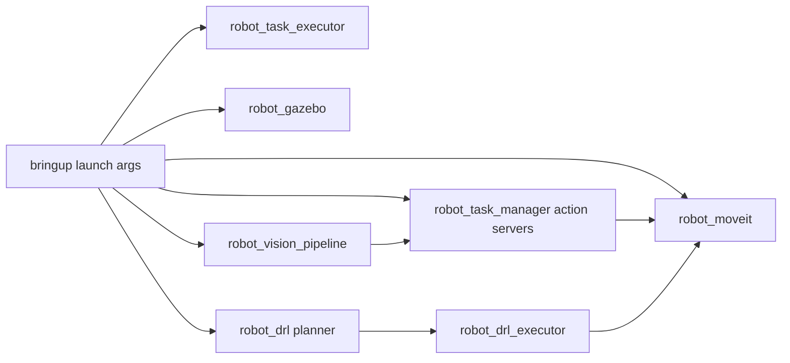

# robot_bringup - Data Flow

`robot_bringup` không định nghĩa topic/service/action riêng; nó nối các subsystem bằng launch.

## Theo mode
- `mock.launch.py`: MoveIt mock + task servers + task executor; vision/static TF chỉ chạy khi `use_vision:=true`.
- `sim.launch.py`: Gazebo trước, sau đó MoveIt/controller spawners, sau đó task servers; DRL backend mặc định bật qua `task_servers_sim.launch.py`.
- `real.launch.py`: MoveIt GUI + task servers `runtime_mode=real` + task executor; vision/static TF hiện mặc định bật.
- Demo/campaign DRL: include `sim.launch.py` với `enable_drl_backend=false`, tự launch `robot_drl_executor`, object spawner, `drl_unified_planner_node` và client/campaign runner.

## Interface được nối gián tiếp
- Action từ `robot_task_manager`: `/move_to_pose`, `/move_to_pose_cartesian`, `/pickplace`, `/drl_pickplace`, `/move_pose_rl`, `/move_target_rl`, `/move_to_pose_obstacle`, ...
- DRL services: `/drl/plan`, `/drl/clear_trajectory`, `/drl/execute_forward`, `/drl/get_execution_status`, `/drl/get_planning_status`.
- Vision topics: `/vision/wood_objects`, `/vision/box_objects`, `/vision/yolo/detections_json`, `/vision/yolo/hough_yaw_json`.
- Executor service: `/move_cartesian_pose_sequence`.

Runtime thực tế vẫn nên xác nhận bằng `ros2 node list`, `ros2 action list`, `ros2 service list` và `ros2 topic list` sau khi launch.
