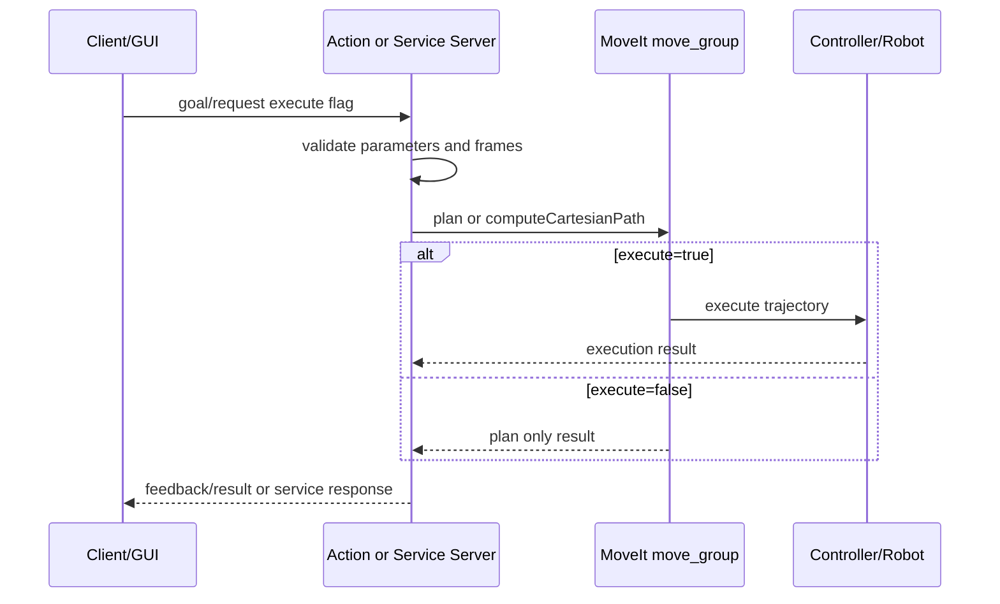

# robot_bringup - MoveIt / Action Execution Flow

## 1. Tổng quan
Bringup không gọi MoveIt trực tiếp trong code, nhưng launch `move_group`, `task_servers_*`, `robot_drl_executor_node` và GUI/client. Thất bại thường đến từ include thiếu package, controller chưa active hoặc action/server chưa sẵn sàng.

## 2. Danh sách action/service liên quan MoveIt
| Action/Service | Type | Server/Client | File source | Vai trò |
|---|---|---|---|---|
| Launch MoveIt stack | launch include | Orchestration | launch/*.launch.py | Khởi động `move_group`/task servers/executor |

## 3. Luồng execute chung
Client tạo goal/request với `execute=true` -> server validate -> MoveIt plan/Cartesian path -> controller execute -> result success/fail.

## 4. Luồng plan-only
Client tạo goal/request với `execute=false` -> server chỉ plan/tính path -> không gửi trajectory tới controller -> trả result/fraction nếu có.

## 5. Chi tiết từng action/service
Bringup không gọi MoveIt trực tiếp trong code, nhưng launch `move_group`, `task_servers_*`, `robot_drl_executor_node` và GUI/client. Thất bại thường đến từ include thiếu package, controller chưa active hoặc action/server chưa sẵn sàng.

## 6. Feedback/result
- Action trong `robot_task_manager` trả stage/progress trong feedback và `success/message` trong result.
- Service executor trả `success/message`; Cartesian service trả thêm `fraction`.

## 7. Điều kiện thành công/thất bại
- Thành công: server/action/service có sẵn, frame hợp lệ, MoveIt plan thành công, controller execute thành công nếu `execute=true`.
- Thất bại: `move_group` chưa chạy, controller inactive, frame khác `base_link` khi executor không hỗ trợ transform, fraction Cartesian thấp, timeout hoặc DRL backend chưa sẵn sàng.

## 8. Phụ thuộc runtime
- `robot_description`, `robot_moveit/move_group`, ros2_control controller, và các action/service con tương ứng.
- Với DRL: cần `drl_unified_planner_node` và `/move_cartesian_pose_sequence`.

## 9. Sơ đồ sequence

