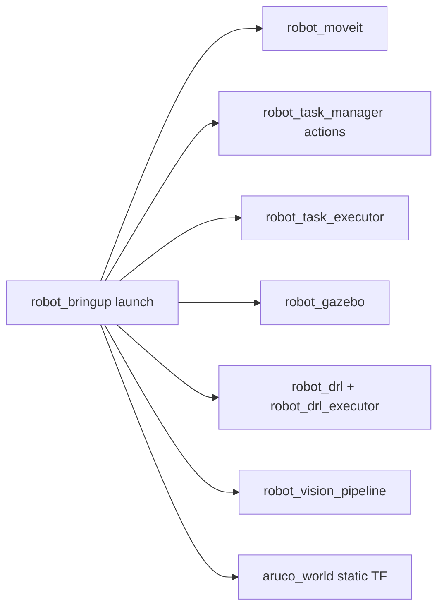

# robot_bringup

## Vai trò
`robot_bringup` là package orchestration cho các mode chạy chính của workspace:
mock hardware, Gazebo simulation, real hardware, vision/static TF và các demo/campaign
DRL pick-place. Package này không build node riêng; nó include launch file và node
từ `robot_moveit`, `robot_gazebo`, `robot_task_manager`, `robot_task_executor`,
`robot_drl`, `robot_drl_executor`, `robot_vision_pipeline` và `tf2_ros`.

## Launch hiện có
| Launch file | Mục đích chính |
|---|---|
| `mock.launch.py` | MoveIt mock hardware + task servers + `robot_task_executor`; vision tùy chọn qua `use_vision:=true`. |
| `sim.launch.py` | Gazebo + MoveIt + task servers sim + controller spawners; vision tùy chọn. |
| `real.launch.py` | MoveIt GUI/task servers với `use_mock=false`, `runtime_mode=real`; vision mặc định bật theo launch hiện tại. |
| `aruco_world_static_tf.launch.py` | Publish static TF tạm thời từ YAML `config/aruco_world_to_base.yaml`. |
| `rl_pick_place_box_gazebo_demo.launch.py` | Demo Gazebo cho `/drl_pickplace` với wood/obstacle box, DRL planner và demo client. |
| `rl_pick_place_campaign.launch.py` | Campaign nhiều lần chạy DRL pick-place trong Gazebo, xuất CSV telemetry theo tham số `output_dir`. |

## Luồng tổng quát


## Chạy nhanh
```bash
cd ~/ros2_dev
source install/setup.bash

ros2 launch robot_bringup mock.launch.py
ros2 launch robot_bringup sim.launch.py
ros2 launch robot_bringup real.launch.py
```

Bật vision trong `mock`/`sim`:
```bash
ros2 launch robot_bringup mock.launch.py use_vision:=true
ros2 launch robot_bringup sim.launch.py use_vision:=true
```

Chạy demo/campaign DRL pick-place trong Gazebo:
```bash
ros2 launch robot_bringup rl_pick_place_box_gazebo_demo.launch.py
ros2 launch robot_bringup rl_pick_place_campaign.launch.py num_runs:=20
```

## Ghi chú trạng thái
- `mock.launch.py` là đường chạy không cần camera/robot thật; vision mặc định tắt.
- `sim.launch.py` dùng Gazebo + `gz_ros2_control`; không có simulated camera feed mặc định, nên các action vision/RL có thể dùng fallback goal hoặc ground-truth object từ demo/campaign.
- `real.launch.py` đặt `runtime_mode=real` cho task servers và dùng `use_mock=false`; mức độ kiểm chứng với robot thật cần xác nhận khi có phần cứng.
- Các launch DRL dùng Python venv cố định `/home/minhquang/venvs/ros_rl/bin/python3`; cần xác nhận đường dẫn này khi chạy trên máy khác.
