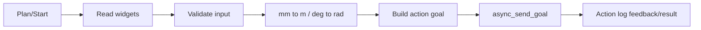

# robot_gui - GUI Flow

## 1. Tổng quan
GUI chính load `ui/robot_gui.ui` và nối ROS qua `RobotGuiNode`, `MainWindow`, `TaskActionController`. Source of truth là source/UI hiện tại.

## 2. Thành phần UI chính
- `TaskControlPanel`: vùng task/action.
- `cbModeControl`: chọn mode điều khiển.
- `taskModeTabs`: nhóm tab task.
- Action log: ghi input validation, goal sent, feedback và result.

## 3. Luồng button

## 4. Plan và Start
- Plan gửi `execute=false`.
- Start gửi `execute=true`.
- Default velocity scale trong GUI là `0.1`.

## 5. Chuyển đơn vị
- Pose nhập trên GUI theo mm; action ROS nhận mét: `mm / 1000.0`.
- Axis jog/run nhập degree hoặc degree/s; hardware service nhận rad hoặc rad/s.

## 6. Interface chính
Action clients tới `/gohome`, `/gohome_2`, `/move_to_pose`, `/move_to_pose_cartesian`, `/move_to_pose_obstacle`, `/move_gripper`, `/pickplace`, `/drl_pickplace`, `/move_checker_board`, `/move_pose_rl`, `/repeatability_test`. GUI cũng dùng `/vision/wood_objects` và `/vision/box_objects` cho các tab vision/pick-place. Hardware service clients tới `/robot_hw/*`.

## 7. Rủi ro runtime
GUI mở được không đảm bảo server đã chạy. Nếu action/service chưa available, log sẽ báo timeout hoặc send goal fail.
