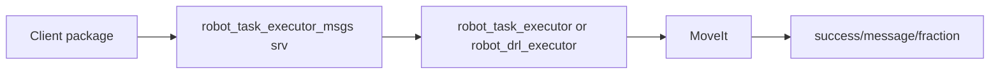

# robot_task_executor_msgs - Data Flow

## 1. Mục tiêu luồng dữ liệu
Chuẩn hóa request/response giữa client và MoveIt service executor.

## 2. Input
Service request do client tạo: named target, joint array, pose, Cartesian point, hoặc PoseStamped sequence.

## 3. Output
Service response với `success`, `message`, và `fraction` cho Cartesian service.

## 4. Internal processing
Không xử lý runtime; ROSIDL generate C++/Python type từ `.srv`.

## 5. Sơ đồ luồng dữ liệu

## 6. Liên kết với package khác
`robot_task_executor`, `robot_drl_executor`, client script hoặc node khác include service type này.

## 7. Các điểm cần chú ý
Pose thường kỳ vọng frame `base_link` ở executor hiện tại; frame rỗng trong `MoveCartesianPoseSequence` được executor DRL thay bằng `base_link`.
