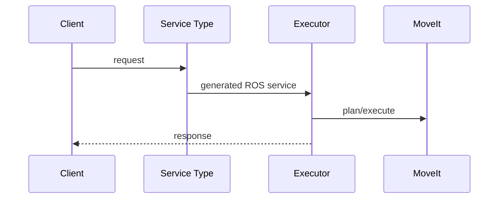

# robot_task_executor_msgs - MoveIt / Action Execution Flow

## 1. Tổng quan
Package này định nghĩa service contract cho MoveIt executor; không tự gọi MoveIt.

## 2. Danh sách action/service liên quan MoveIt
| Action/Service | Type | Server/Client | File source | Vai trò |
|---|---|---|---|---|
| `MoveToNamedTarget.srv` | service type | Interface | `srv/MoveToNamedTarget.srv` | Named target |
| `MoveToJointTarget.srv` | service type | Interface | `srv/MoveToJointTarget.srv` | Joint target |
| `MoveToPoseTarget.srv` | service type | Interface | `srv/MoveToPoseTarget.srv` | Pose target |
| `MoveCartesianPoseSequence.srv` | service type | Interface | `srv/MoveCartesianPoseSequence.srv` | Cartesian PoseStamped[] |

## 3. Luồng execute chung
Client tạo request `execute=true`; executor nhận service type này rồi gọi MoveIt.

## 4. Luồng plan-only
Client tạo request `execute=false`; executor plan nhưng không execute trajectory.

## 5. Chi tiết từng action/service
Các service chỉ định hình dữ liệu. Logic success/fail nằm trong `robot_task_executor` hoặc `robot_drl_executor`.

## 6. Feedback/result
Service response có `success/message`; Cartesian response có thêm `fraction`.

## 7. Điều kiện thành công/thất bại
Phụ thuộc server triển khai, MoveIt và controller runtime.

## 8. Phụ thuộc runtime
Không có runtime riêng; phụ thuộc build-time vào generated interfaces.

## 9. Sơ đồ sequence

