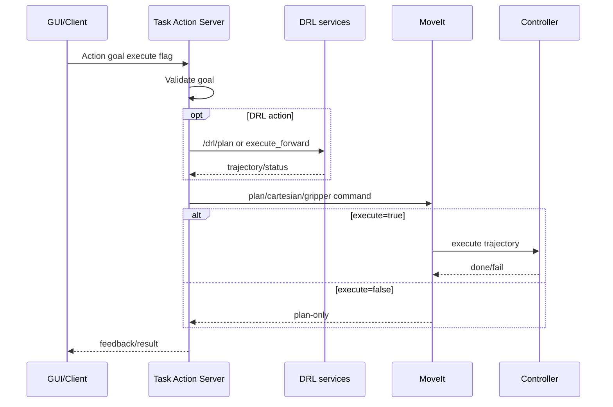

# robot_task_manager - MoveIt / Action Execution Flow

## 1. Tổng quan
Package này là action layer chính cho MoveIt. Các server nhận action goal, validate, gọi MoveIt executor/gripper executor hoặc action/service con, rồi trả feedback/result.

## 2. Danh sách action/service liên quan MoveIt
| Action/Service | Type | Server/Client | File source | Vai trò |
|---|---|---|---|---|
| `/gohome` | `GoHome.action` | Server | `src/gohome_server.cpp` | Về home |
| `/move_to_pose` | `MoveToPose.action` | Server | `src/move_to_pose_server.cpp` | PTP pose |
| `/move_to_pose_cartesian` | `MoveToPoseCartesian.action` | Server | `src/move_to_pose_cartesian_server.cpp` | Cartesian pose |
| `/move_checker_board` | `CheckerBoard.action` | Server | `src/move_checker_board_server.cpp` | Pattern checker board |
| `/move_gripper` | `MoveGripper.action` | Server | `src/move_gripper_server.cpp` | Gripper MoveIt group |
| `/pickplace` | `PickPlace.action` | Server composite | `src/pickplace_server.cpp` | Pick-place |
| `/drl_pickplace` | `DrlPickPlace.action` | Server composite | `src/drl_pickplace_server.cpp` | DRL pick-place |
| `/move_pose_rl` | `MovePoseRl.action` | Server | `src/move_pose_rl_server.cpp` | DRL move pose |
| `/repeatability_test` | `RepeatabilityTest.action` | Server composite | `src/repeatability_test_server.cpp` | Repeatability loop |
| `/drl/plan`, `/drl/execute_forward`, `/drl/get_execution_status` | `std_srvs/Trigger` | Client | DRL servers | DRL backend |

## 3. Luồng execute chung
GUI/client gửi goal `execute=true` -> server validate pose/velocity -> MoveIt plan hoặc DRL plan -> execute trajectory/gripper -> feedback stage/progress -> result.

## 4. Luồng plan-only
Goal `execute=false` -> server vẫn plan/tính Cartesian/DRL trajectory nhưng bỏ qua execution tới controller/hardware.

## 5. Chi tiết từng action/service
### /move_to_pose
- Type: `MoveToPose.action`.
- Goal: `target_pose`, `velocity_scale`, `execute`.
- Result: `success`, `message`.
- Feedback: `stage`, `progress`.
- Reject/fail: velocity ngoài `(0,1]`, plan/execute fail.

### /move_to_pose_cartesian
- Type: `MoveToPoseCartesian.action`.
- Goal giống move pose, xử lý bằng Cartesian path.
- Success phụ thuộc MoveIt Cartesian planning/execution.

### /move_gripper
- Type: `MoveGripper.action`.
- Goal: `position`, `execute`.
- Dùng gripper executor; position theo mét trong action/source usage.

### /pickplace
- Type: `PickPlace.action`.
- Composite flow: open gripper -> move pre-pick -> Cartesian down -> close gripper -> lift -> move pre-place -> Cartesian down -> open -> retreat.
- Gọi action con `move_to_pose`, `move_to_pose_cartesian`, `move_gripper`.

### /drl_pickplace
- Type: `DrlPickPlace.action`.
- Goal: `target_pick`, `target_place`, `gripper_close_width_m`, `execute`.
- Phụ thuộc `drl_unified_planner_node`, `/drl/plan`, `/drl/execute_forward`, `/drl/get_execution_status`, MoveIt Cartesian sub-action và gripper action.

### /move_pose_rl
- Type: `MovePoseRl.action`.
- Goal: `target_pose`, `velocity_scale`, `execute`.
- Set parameter planner, gọi DRL plan, nhận trajectory và execute qua DRL service khi cần.

### /repeatability_test
- Type: `RepeatabilityTest.action`.
- Loop: move retract -> Cartesian meas pose -> wait settle -> back retract -> disturb 1 -> back retract -> repeat N times.
- Axis constants: `AXIS_X=0`, `AXIS_Y=1`, `AXIS_Z=2`.

## 6. Feedback/result
Feedback thường gồm stage/current_stage và progress; DRL action có thêm current pose. Result có `success/message`, một số action có `failed_stage` hoặc `completed_count`.

## 7. Điều kiện thành công/thất bại
Thành công khi action con/MoveIt/DRL service sẵn sàng, frame hợp lệ, plan và execution thành công. Fail khi timeout, velocity invalid, planner unavailable, Cartesian fraction thấp hoặc controller không active.

## 8. Phụ thuộc runtime
`robot_moveit/move_group`, ros2_control controller, `robot_drl` nếu dùng DRL action, action servers con cho composite flow.

## 9. Sơ đồ sequence

