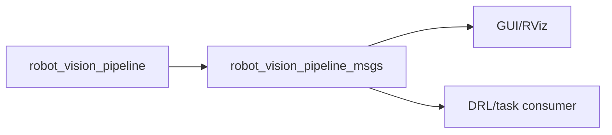

# robot_vision_pipeline_msgs - Data Flow

## 1. Mục tiêu luồng dữ liệu
Chuẩn hóa dữ liệu object detection từ vision pipeline sang downstream.

## 2. Input
Dữ liệu detection/pose trong node vision trước khi publish.

## 3. Output
ROS messages `BoxDetection`, `WoodArray`, `BoxArray`.

## 4. Internal processing
Không xử lý runtime; ROSIDL generate type từ `.msg`.

## 5. Sơ đồ luồng dữ liệu

## 6. Liên kết với package khác
`robot_vision_pipeline` là publisher chính; downstream consumer tùy pipeline.

## 7. Các điểm cần chú ý
Pose dùng `geometry_msgs/Pose` và header frame từ publisher; luôn kiểm tra frame khi dùng cho motion planning.
